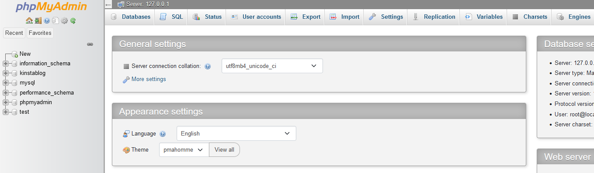
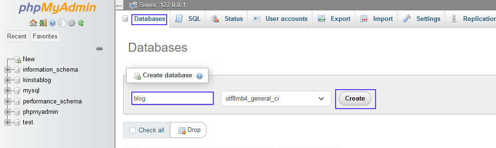
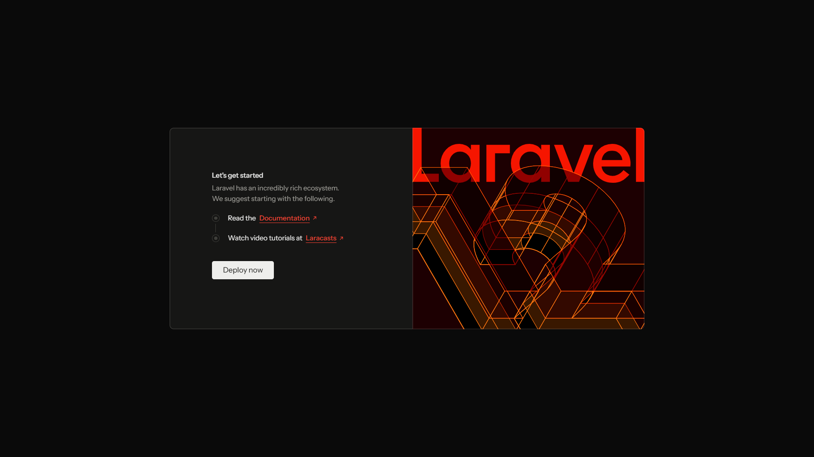
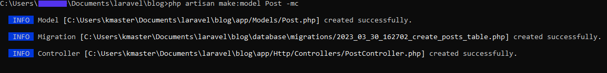
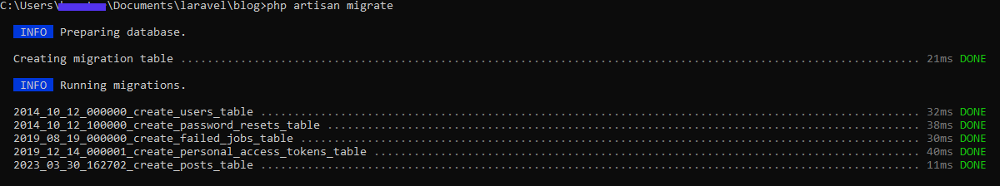
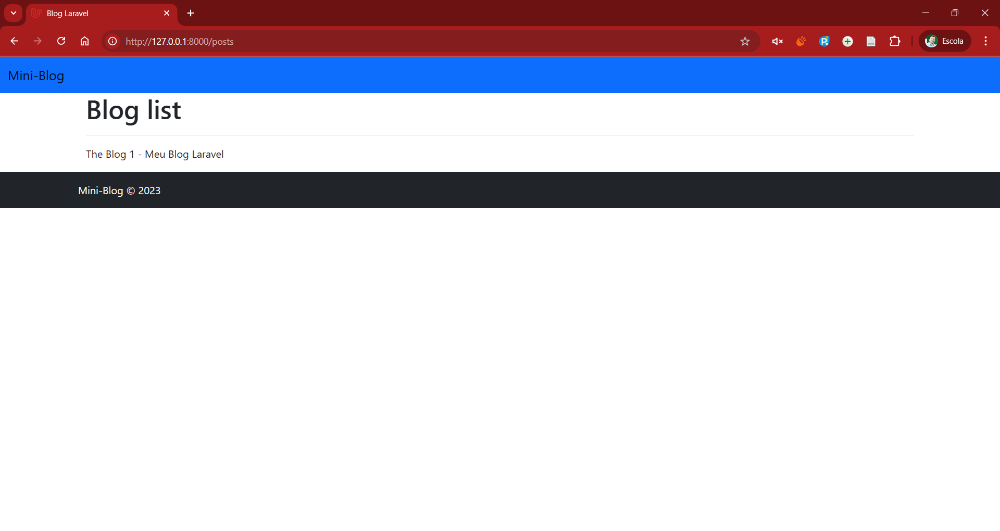

# Criando um Blog com Laravel

## Pré-requisitos

<style>
    img {
        display: block;
        max-width: 98%;
    }
</style>

* Um servidor web, por exemplo o XAMPP.
* Composer instalado.
* O Laravel instalado.

## Teste os pré-requisitos

Para verificar se todos os pré-requisitos estão atendidos, você pode executar os seguintes comandos no terminal (CMD):

```bash
php --version
composer --version
laravel --version
```

Tente também abrir o XAMPP e iniciar o servidor Apache e MySQL.

Para seguir, deixe o servidor em execução e abra um novo terminal (CMD) para criar um novo projeto Laravel.

## Configurando a base de dados

1. Abra o PHPMyAdmin. Na tela do painel do XAMPP, clique em "Admin" no módulo MySQL ou acesse `http://localhost/phpmyadmin` ou `http://localhost:8080/phpmyadmin`.

2. Para criar o banco de dados, acesse a aba Databases/Base de Dados e digite “blog” no campo Create database.
3. Em seguida, clique em Create/Criar.


## Criando o projeto Laravel

1. Abra um terminal (CMD) e navegue até o diretório onde deseja criar o projeto Laravel.
```cd c:\xampp\htdocs```
2. Execute o seguinte comando para criar um novo projeto Laravel chamado "blog":

```bash
laravel new blog
```

* A instalação pode demorar um pouco, então tenha paciência.

* Quando o instalador do Laravel solicitar, escolha as seguintes opções:
```bash
Which starter kit would you like to install? [None]:
  [none    ] None
  [react   ] React
  [vue     ] Vue
  [livewire] Livewire
 > none

Which database will your application use? [SQLite]:
  [sqlite ] SQLite
  [mysql  ] MySQL
  [mariadb] MariaDB
  [pgsql  ] PostgreSQL
  [sqlsrv ] SQL Server (Missing PDO extension)
 > mysql

Default database updated. Would you like to run the default database migrations? (yes/no) [yes]:
 > yes
 ```

3. Após a conclusão da instalação, navegue até o diretório do projeto:

```bash
cd blog
```

4. Abra o projeto no seu editor de código favorito.

```bash
code .
```

5. Agora executaremos os comandos na janela TERMINAL do Visual Studio Code. Para isso, use o atalho `Ctrl + J`.

6. Vamos testar a instalação do Laravel executando o seguinte comando:

```bash
php artisan serve
```

7. Segure `Ctrl` e clique no link que aparece no terminal para abrir o aplicativo no navegador.


❌ Em caso de mensagem de erro, pressione `Ctrl + C` para interromper o servidor e verifique se o Apache e o MySQL estão em execução no XAMPP. Confira o arquivo `.env` para garantir que as configurações do banco de dados estão corretas. O nome do banco de dados deve ser "blog". Por fim, execute as migrações do banco de dados com o comando:

```bash
php artisan migrate
```

Exemplo de configuração do arquivo `.env`:

```env
DB_CONNECTION=mysql
DB_HOST=127.0.0.1
DB_PORT=3306
DB_DATABASE=blog
DB_USERNAME=root
DB_PASSWORD=
```

✅ Se tudo estiver correto, execute o seguinte comando para acessar o aplicativo no navegador:

```bash
php artisan serve
```

## Criando a tabela de Posts

⚠️ Pare sempre a execução do servidor antes de executar comandos no terminal.

1. Em seu terminal (dentro da pasta do projeto), execute `php artisan make:model Post -mc` para criar um modelo chamado `Post`, uma tabela chamada posts, um arquivo de migração e um controlador.


2. Verifique o diretório database/migrations e abra o arquivo de migração que você acabou de criar. Ele tem o seguinte formato: `YYYY_MM_DD_ID_create_posts_table.php`.

3. No método `up()` do arquivo de migração, crie um schema com os atributos `title`, `description` e `image`.

```php
public function up() {
  Schema::create('posts', function (Blueprint $table) {
    $table->id();
    $table->string('title')->nullable();
    $table->text('description')->nullable();
    $table->string('image')->nullable();
    $table->timestamps();
  });
}
```

4. Agora vá até o terminal e migre as alterações usando php artisan migrate, conforme mostrado abaixo:



5. Acesse o PHPMyAdmin e verifique se a tabela `posts` foi criada corretamente.


## Criando os controladores e Views

1. Se o comando de criação do modelo foi executado corretamente com a flag `-mc`, um controlador chamado `PostController` foi criado automaticamente. Verifique o diretório `app/Http/Controllers` para confirmar.

2. Vá até o diretório `app/Http/Controllers`, abra o arquivo `PostController.php` e crie um método controlador index. O método controlador renderiza um texto simples no navegador. Para fazer isso, adicione o seguinte código à classe `PostController`:

```php
public function index() {
    $post = "Meu Blog Laravel";
    return view('posts.index', ['post'=>$post]);
}
```

* Esse método passa $post como uma variável de contexto para a seção views do template index do Blade. $post contém texto para ser exibido, que neste caso é “Meu Blog Laravel”. Você substituirá isso com o loop das publicações mais tarde.

3. No diretório `resources/views`, crie dois novos diretórios: `layouts` e `posts`.
4. No diretório `layouts`, crie um arquivo `app.blade.php`. Outros arquivos Blade herdarão deste.
5. Copie este código em `app.blade.php`:

```php
<!DOCTYPE html>
<html lang="pt-BR">
<head>
    <meta charset="UTF-8">
    <meta name="viewport" content="width=device-width, initial-scale=1">
    <title>Blog Laravel</title>
    <link href="https://cdn.jsdelivr.net/npm/bootstrap@5.2.3/dist/css/bootstrap.min.css" rel="stylesheet" integrity="sha384-rbsA2VBKQhggwzxH7pPCaAqO46MgnOM80zW1RWuH61DGLwZJEdK2Kadq2F9CUG65" crossorigin="anonymous">
    <link rel="stylesheet" href="{{ asset('css/app.css') }}">
</head>
<body>
    <!-- Navbar -->
    <header>
    <nav class="navbar bg-primary">
        <div class="container-fluid">
        <a class="navbar-brand" href="{{ route('posts.index') }}">Mini-Blog</a>
        </div>
    </nav>
    </header>

    <!-- Body -->
    <div class="container">
        @yield('content')
    </div>

    <!-- Footer -->
    <footer class="footer mt-auto py-3 bg-dark">
        <div class="container d-lg-flex justify-content-between">
            <span class="text-light">Mini-Blog © 2023</span>
        </div>
    </footer>
</body>

</html>
```

6. No diretório posts, crie um arquivo Blade chamado index.blade.php e adicione o seguinte código:

```php
@extends('layouts.app')
@section('content')
<div class="container">
  <div class="titlebar">
    <h1>Blog list</h1>
  </div>
  <hr>
  <p>The Blog 1 - {{ $post }}</p>
</div>
@endsection
```

* Esse código se estende do arquivo app.blade.php na página de layouts. Quando é renderizado no navegador, ele exibe o conteúdo de cada publicação do blog, juntamente com a barra de navegação e o rodapé herdados do arquivo app.blade.php na pasta layouts. Entre as tags de seção, o conteúdo do controlador é passado para ser renderizado no navegador quando o aplicativo é executado.

7. Defina a rota no diretório routes. A definição da rota permite o carregamento automático pelo `RouteServiceProvider` no diretório `App/Providers`. O `RouteServiceProvider` é a classe responsável pelo carregamento dos arquivos de rota do aplicativo.

8. No arquivo `routes/web.php`, importe PostController usando `use App\Http\Controllers\PostController`.

9. Então defina a rota adicionando `Route::resource('posts', PostController::class);` ao arquivo `routes/web.php`.

O arquivo `routes/web.php` deve ficar assim:

```php
<?php

use App\Http\Controllers\PostController;
use Illuminate\Support\Facades\Route;

Route::get('/', function () {
    return view('welcome');
});


Route::resource('posts', PostController::class);
```

10. Com o servidor de desenvolvimento do Vite ainda em execução, use `php artisan serve` para executar o aplicativo em seu terminal.

11. Com seu navegador, abra `http://127.0.0.1:8000/posts` para ver a nova lista de artigos do blog.



## Crie a página de artigos do blog

1. Crie artigos de blog inserindo um título, adicionando uma descrição e carregando uma imagem. Em seguida, exiba seus artigos em ordem sequencial.

3. No diretório `app/Models`, abra o arquivo `Post.php`.

4. Na classe `Post` abaixo do bloco de código `use HasFactory;`, adicione `protected $fillable = ['title', 'description', 'image'];`.

* O arquivo `app/Models/Post.php` deve ficar assim:

```php
<?php
namespace App\Models;

use Illuminate\Database\Eloquent\Factories\HasFactory;
use Illuminate\Database\Eloquent\Model;

class Post extends Model
{
    use HasFactory;

    protected $fillable = ['title', 'description', 'image'];
}

```

5. No arquivo `app/Http/Controllers/PostController.php`, importe o modelo Post usando `use App\Models\Post;`.

6. Substitua os métodos de controle index e create criados anteriormente na classe PostController pelo código abaixo:

```php
<?php

namespace App\Http\Controllers;

use App\Models\Post;
use Illuminate\Http\Request;

class PostController extends Controller
{
    public function index()
    {
        $posts = Post::all();
        return view('posts.index', ['posts' => $posts]);
    }

    public function create()
    {
        return view('posts.create');
    }

    public function store(Request $request)
    {
        $request->validate([
            'title' => 'required',
            'description' => 'required',
            'image' => 'required|image|mimes:jpeg,png,jpg,gif,svg|max:2048',
        ]);

        $post = new Post;

        $file_name = time() . '.' . request()->image->getClientOriginalExtension();
        request()->image->move(public_path('images'), $file_name);

        $post->title = $request->title;
        $post->description = $request->description;
        $post->image = $file_name;

        $post->save();
        return redirect()->route('posts.index')->with('success', 'Post created successfully.');
    }

    public function show(Post $post)
    {
        return view('posts.show', ['post' => $post]);
    }
}
```

## Atualize o arquivo de rotas

1. Vá para o arquivo `routes/web.php` e atualize as rotas:

```php
<?php

use App\Http\Controllers\PostController;
use Illuminate\Support\Facades\Route;

Route::resource('/', PostController::class)->names([
  'index' => 'posts.index',
  'create' => 'posts.create',
  'store' => 'posts.store',
  'show' => 'posts.show',
]);
```

## Crie as views usando Blade

1. Abra o diretório `resources/views` e crie os seguintes arquivos pasta chamada `posts`.
2. Dentro da pasta `posts`, crie os seguintes arquivos Blade:
   - `create.blade.php`
   - `show.blade.php`

3. O arquivo `create.blade.php` deve conter o seguinte código:

```php
@extends('layouts.app')
@section('content')
<div class="container">
  <h1>Add Post</h1>
  <section class="mt-3">
    <form method="post" action="{{ route('posts.store') }}" enctype="multipart/form-data">
      @csrf
      <!-- Error message when data is not inputted -->
      @if ($errors->any())
        <div class="alert alert-danger">
          <ul>
            @foreach ($errors->all() as $error)
              <li>{{ $error }}</li>
            @endforeach
          </ul>
        </div>
      @endif
      <div class="card p-3">
        <label for="floatingInput">Title</label>
        <input class="form-control" type="text" name="title">
        <label for="floatingTextArea">Description</label>
        <textarea class="form-control" name="description" id="floatingTextarea" cols="30" rows="10"></textarea>
        <label for="formFile" class="form-label">Add Image</label>
        
        <input class="form-control" type="file" name="image">
      </div>
      <button class="btn btn-secondary m-3">Save</button>
    </form>
  </section>
    
</div>
@endsection
```

* Nesse código, o `create.blade.php` herda o conteúdo do `app.blade.php` no diretório `layouts` usando `@extends('layouts.app')`. Esse conteúdo inclui um cabeçalho, uma barra de navegação e um rodapé. Após adicionar o texto Add Post na tag `h1`, você criou um formulário com o método post que contém a ação `{{route('posts.store')}}`.

* O código `enctype="multipart/form-data"` permite o upload de imagens, e o `csrf` protege o formulário de ataques cross-site. Em seguida, as mensagens de erro exibem entradas de campo inválidas e usam `field attributes` para criar etiquetas e entradas para o formulário.

4. Agora, substitua o código no arquivo index.blade.php pelo código abaixo para exibir todas as publicações do blog:

```php
@extends('layouts.app')
@section('content')
<div class="container">
  <div class="titlebar">
    <a class="btn btn-secondary float-end mt-3" href="{{ route('posts.create') }}" role="button">Add Post</a>
    <h1>Mini post list</h1>
  </div>
    
  <hr>
  <!-- Message if a post is posted successfully -->
  @if ($message = Session::get('success'))
  <div class="alert alert-success">
    <p>{{ $message }}</p>
  </div>
  @endif
         @if (count($posts) > 0)
    @foreach ($posts as $post)
      <div class="row">
        <div class="col-12">
          <div class="row">
            <div class="col-2">
              image)}}" alt="">
            </div>
            <div class="col-10">
              <h4>{{$post->title}}</h4>
            </div>
          </div>
          <p>{{$post->description}}</p>
          <hr>
        </div>
      </div>
    @endforeach
  @else
    <p>No Posts found</p>
  @endif
</div>
@endsection
```

## Teste o sistema

1. Execute o comando `php artisan serve` no terminal para iniciar o servidor.
2. Acesse `http://localhost:8000` no seu navegador.
3. Você deve ver a página inicial do Laravel.
4. Navegue até a página de criação de postagens clicando no botão "Add Post". Crie uma postagem de exemplo.
5. Volte para a página inicial `http://localhost:8000/` e verifique se as postagens aparecem na lista.

## Atividade

Melhore o visual da página de listagem de postagens (`index.blade.php`) adicionando CSS e novos resursos. Crie uma função para editar e excluir postagens.